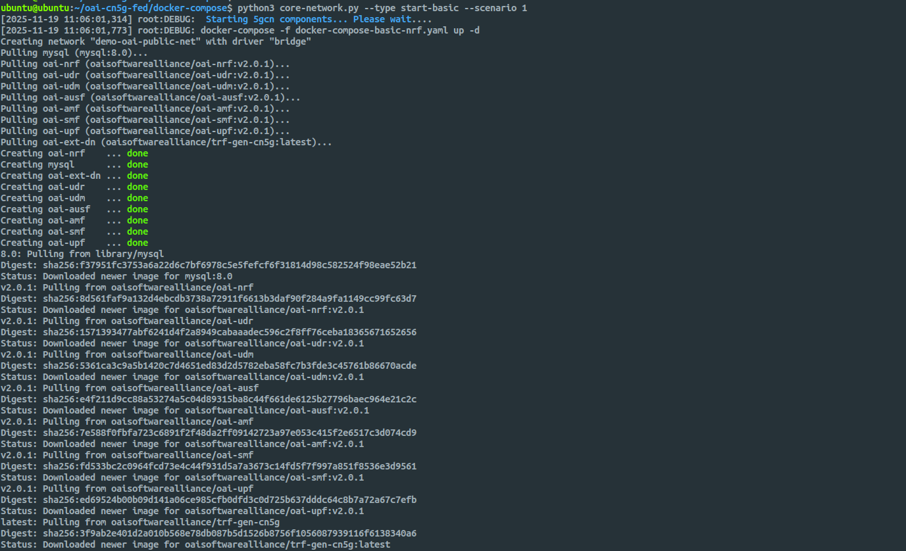

# OAI CN5G Deployment Guide

This repository provides guidance for deploying the OpenAirInterface (OAI) 5G Core (CN5G).

> [!NOTE]
> For the official documentation, please refer to the [OAI 5G Core Deployment Guide](https://gitlab.eurecom.fr/oai/openairinterface5g/-/blob/develop/doc/NR_SA_Tutorial_OAI_CN5G.md?ref_type=heads).

## 1\. System Preparation

**Perform these steps regardless of which deployment method you choose.**

### 1.1 Hardware Requirements

Ensure your machine meets the following specifications:

| Component   | Minimum Specification    |
| :---------- | :----------------------- |
| **OS**      | Ubuntu 22.04 LTS         |
| **CPU**     | 8 cores x86_64 @ 3.5 GHz |
| **RAM**     | 32 GB                    |
| **Network** | 2 Interfaces             |

### 1.2 Install Pre-requisites & Docker

Update your system and install the necessary tools and Docker engine.

```bash
# 1. Update and install basic tools
sudo apt update
sudo apt install -y git net-tools putty unzip ca-certificates curl

# 2. Add Docker's official GPG key
sudo install -m 0755 -d /etc/apt/keyrings
sudo curl -fsSL https://download.docker.com/linux/ubuntu/gpg -o /etc/apt/keyrings/docker.asc
sudo chmod a+r /etc/apt/keyrings/docker.asc

# 3. Add the repository to Apt sources
echo "deb [arch=$(dpkg --print-architecture) signed-by=/etc/apt/keyrings/docker.asc] https://download.docker.com/linux/ubuntu $(. /etc/os-release && echo "$VERSION_CODENAME") stable" | sudo tee /etc/apt/sources.list.d/docker.list > /dev/null

# 4. Install Docker packages
sudo apt update
sudo apt install -y docker-ce docker-ce-cli containerd.io docker-buildx-plugin docker-compose-plugin docker-compose

# 5. Add current user to docker group (avoids using sudo for docker)
sudo usermod -a -G docker $(whoami)
```

> [!TIP]
> Log out and back in to apply group changes or run `su - $USER` to start a new session.

### 1.3 Enable IP Forwarding

This is required for the core network functions to route traffic correctly.

```bash
sudo sysctl net.ipv4.conf.all.forwarding=1
sudo iptables -P FORWARD ACCEPT
```

## 2\. Deployment Options

Choose **one** of the following methods.

### Option A: Quick Start (Docker Compose)

Use this method for a fast, pre-packaged tutorial setup.

**1. Download Configuration Files**

```bash
wget -O ~/oai-cn5g.zip https://gitlab.eurecom.fr/oai/openairinterface5g/-/archive/develop/openairinterface5g-develop.zip?path=doc/tutorial_resources/oai-cn5g
unzip ~/oai-cn5g.zip
mv ~/openairinterface5g-develop-doc-tutorial_resources-oai-cn5g/doc/tutorial_resources/oai-cn5g ~/oai-cn5g
rm -r ~/openairinterface5g-develop-doc-tutorial_resources-oai-cn5g ~/oai-cn5g.zip
```

**2. Pull Images & Start**

```bash
cd ~/oai-cn5g
docker compose pull
docker compose up -d
```

**Stop the Network**

```bash
cd ~/oai-cn5g
docker compose down
```

### Option B: Advanced Source Deployment (python wrapper)

Use this method if you need to patch configurations, develop features, or use the OAI python wrapper scripts.

**1. Clone the Repository**

```bash
git clone https://gitlab.eurecom.fr/oai/cn5g/oai-cn5g-fed.git
cd oai-cn5g-fed/
git checkout v2.0.1
```

**2. Sync Components**

This pulls the submodule references for the specific network functions.

```bash
./scripts/syncComponents.sh
```

**3. Apply Configuration Patches**

You need to update the `nrf` config and the `mysql` database initialization to ensure consistent user profiles.

**Method A: Apply via Git (Recommended)**

If you have the patch file ready:

```bash
git apply patch-files/oai-cn5g-fed.patch
```

**Method B: Manual Edit**

If you want to manually edit the files, make the following changes:

```patch
diff --git a/docker-compose/conf/basic_nrf_config.yaml b/docker-compose/conf/basic_nrf_config.yaml
index c55f7c9..acbf4d2 100644
--- a/docker-compose/conf/basic_nrf_config.yaml
+++ b/docker-compose/conf/basic_nrf_config.yaml
@@ -222,7 +222,7 @@ upf:
   support_features:
     enable_bpf_datapath: no    # If "on": BPF is used as datapath else simpleswitch is used, DEFAULT= off
     enable_snat: yes           # If "on": Source natting is done for UE, DEFAULT= off
-  remote_n6_gw: localhost      # Dummy host since simple-switch does not use N6 GW
+  remote_n6_gw: 127.0.0.1      # Dummy host since simple-switch does not use N6 GW
   smfs:
     - host: oai-smf            # To be used for PFCP association in case of no-NRF
   upf_info:
diff --git a/docker-compose/database/oai_db2.sql b/docker-compose/database/oai_db2.sql
index 35cb957..f854dc1 100755
--- a/docker-compose/database/oai_db2.sql
+++ b/docker-compose/database/oai_db2.sql
@@ -77,6 +77,7 @@ CREATE TABLE `AccessAndMobilitySubscriptionData` (
 ) ENGINE=InnoDB DEFAULT CHARSET=utf8;

 INSERT INTO `AccessAndMobilitySubscriptionData` (`ueid`, `servingPlmnid`, `nssai`) VALUES
+('208950000000031', '20895','{\"defaultSingleNssais\": [{\"sst\": 1, \"sd\": \"0xffffff\"}]}'),
 ('208950000000125', '20895','{\"defaultSingleNssais\": [{\"sst\": 1, \"sd\": \"1\"}]}'),
 ('208950000000126', '20895','{\"defaultSingleNssais\": [{\"sst\": 1, \"sd\": \"1\"}]}'),
 ('208950000000127', '20895','{\"defaultSingleNssais\": [{\"sst\": 1, \"sd\": \"1\"}]}'),
@@ -311,7 +312,7 @@ CREATE TABLE `SessionManagementSubscriptionData` (
 --

 INSERT INTO `SessionManagementSubscriptionData` (`ueid`, `servingPlmnid`, `singleNssai`, `dnnConfigurations`) VALUES
-('208950000000031', '20895', '{\"sst\": 222, \"sd\": \"123\"}','{\"default\":{\"pduSessionTypes\":{ \"defaultSessionType\": \"IPV4\"},\"sscModes\": {\"defaultSscMode\": \"SSC_MODE_1\"},\"5gQosProfile\": {\"5qi\": 6,\"arp\":{\"priorityLevel\": 1,\"preemptCap\": \"NOT_PREEMPT\",\"preemptVuln\":\"NOT_PREEMPTABLE\"},\"priorityLevel\":1},\"sessionAmbr\":{\"uplink\":\"100Mbps\", \"downlink\":\"100Mbps\"},\"staticIpAddress\":[{\"ipv4Addr\": \"12.1.1.4\"}]}}');
+('208950000000031', '20895', '{\"sst\": 1, \"sd\": \"0xffffff\"}','{\"oai\":{\"pduSessionTypes\":{ \"defaultSessionType\": \"IPV4\"},\"sscModes\": {\"defaultSscMode\": \"SSC_MODE_1\"},\"5gQosProfile\": {\"5qi\": 6,\"arp\":{\"priorityLevel\": 1,\"preemptCap\": \"NOT_PREEMPT\",\"preemptVuln\":\"NOT_PREEMPTABLE\"},\"priorityLevel\":1},\"sessionAmbr\":{\"uplink\":\"100Mbps\", \"downlink\":\"100Mbps\"},\"staticIpAddress\":[{\"ipv4Addr\": \"12.1.1.4\"}]}}');
 INSERT INTO `SessionManagementSubscriptionData` (`ueid`, `servingPlmnid`, `singleNssai`, `dnnConfigurations`) VALUES
 ('208950000000032', '20895', '{\"sst\": 222, \"sd\": \"123\"}','{\"default\":{\"pduSessionTypes\":{ \"defaultSessionType\": \"IPV4\"},\"sscModes\": {\"defaultSscMode\": \"SSC_MODE_1\"},\"5gQosProfile\": {\"5qi\": 6,\"arp\":{\"priorityLevel\": 1,\"preemptCap\": \"NOT_PREEMPT\",\"preemptVuln\":\"NOT_PREEMPTABLE\"},\"priorityLevel\":1},\"sessionAmbr\":{\"uplink\":\"100Mbps\", \"downlink\":\"100Mbps\"}}}');
 -- --------------------------------------------------------
```

**4. Deploy the Core**

Use the Python wrapper script to start the "Basic" scenario (AMF, SMF, UPF, NRF).

```bash
cd docker-compose
python3 core-network.py --type start-basic --scenario 1
```




**Stop the Core**

```bash
python3 core-network.py --type stop-basic --scenario 1
```

> [!WARNING]  
> Do not abruptly power off your VM. Sudden shutdowns can corrupt NRF registration state and cause inconsistent network-function discovery. Always stop the core properly before shutting down the machine.

Follow the [ngkore/OAI-RAN](https://github.com/ngkore/OAI-RAN) guide to build and configure the RAN components (gNB and nrUE).
